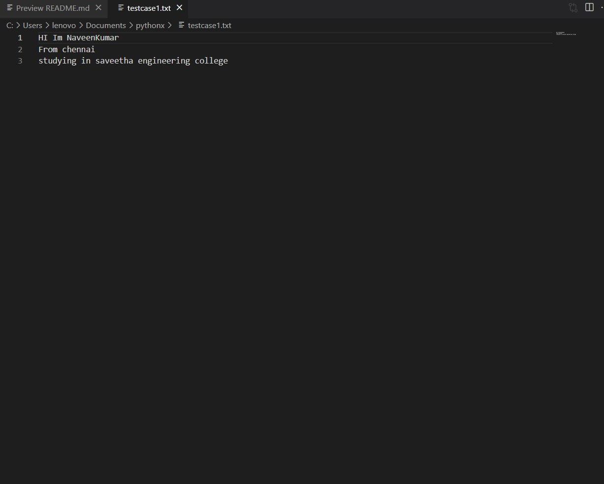
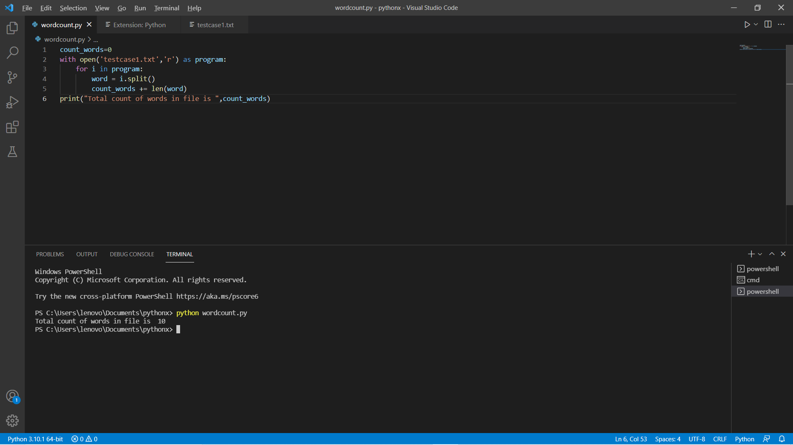

# Word-count
## AIM:
To write a python program for getting the word count from a text.
## EQUIPEMENT'S REQUIRED: 
PC
Anaconda - Python 3.7
## ALGORITHM: 
### Step 1: 
 To open the text file and made it to reading mode
### step 2:
 use for loop in program .
### Step 3: 
 then calling the function name as "program"
### Step 4: 
split the words using .split()
### Step 5:  
call count_words to execute the length of words and give an initial value as 0.
### Step 6: 
print count_words to check and Run the program without errors.


## PROGRAM:
```
#developed by : NaveenKumar.S
#registered number:21500481

count_words=0
with open('testcase1.txt','r') as program:
    for i in program:
        word = i.split()
        count_words += len(word) 
print("Total count of words in file is ",count_words)   


```

### OUTPUT:
text file :

OUTPUT IS:



## RESULT:
Thus the program is written to find the word count from a text.
